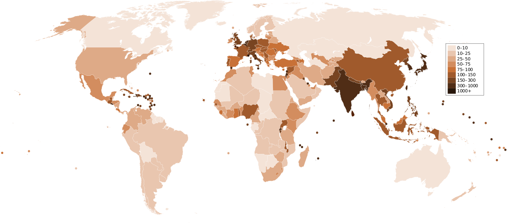

# Implications of CRS on Population Density

Your choice of map projection can have drastic impacts on the accuracy of your analysis.  We're going to look at a simple example to highlight just how drastic the impact can make on the results you obtain!  For example, lets look at population density (D):

P is the population, which we can get that from census data.  A is the area, we have to calculate that from our data layer.  Our calculation of area will be dependent upon the map projection we choose.  Generally, the map unit is meters, so our resulting population density will be "people per square meeter".  This isn't too meaningful as you can't fit very many humans in one square meter.  Generally, we want to convert to squaree kilometers, which can be done by multiplying by 1,000,000 (one million square meters in a square kilometer).

## Countries by Population Density

The most densely populated countries are small "City-States" like Monaco (19,000 ppl km-2) and Singapore (8,000 ppl km-2), they have relatively large populations (38,000 ppl) and (5,757,000 ppl) but very small areas (2 km2) and (716 km2).

Mongolia is one of the least densely populated countries (2 ppl km-2) because it has a small population (3,170,000 ppl) but a very large area (1,564,000 km2).

[data source](https://en.wikipedia.org/wiki/List_of_countries_and_dependencies_by_population_density)