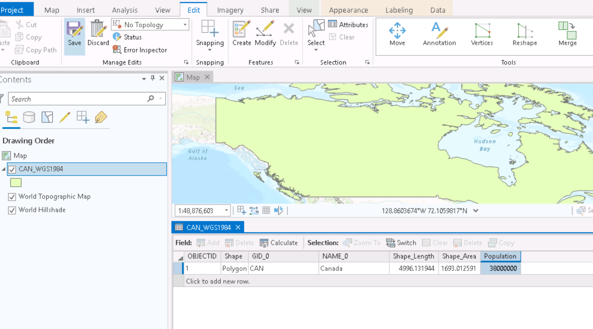

1. TOC
{:toc}

# Setting Up a Project

**1**{: .label .label-red } Create a new project called "Pop Density", following the same steps as in [Module 1](https://june-skeeter.github.io/Module1_GEOS270/docs/Application.html).  *Note* (If you are working on a Geography lab computer, remember to **work in C:/Temp** but save to your **H:/** drive.  If you are unsure what that means, ask your TA for assistance or see the [lab access page on the syllabus](https://june-skeeter.github.io/GEOS270W1/docs/Labs.html#saving-your-work)
* We introduced the concept of geodatabases last week.  To review, **a geodatabase (.gdb) is**: a file management structure that is designed specifically for ESRI products.  You don't have to store your data in a .gdb, Arc Pro can work with data stored in standard formats as well.  **But** .gdb have some enhanced functionality that can be useful, so a .gdb is created by default with every new project.  If you expand the Pop_Density folder, you will see ArcPro has created a Pop_Density.gdb for you already.

---

# Importing a Feature Class

**2**{: .label .label-red } Right click on Pop_Density.gdb and select >> Import >> Feature Class.  The Feature Class to Feature Class tool will open.  Specify CAN_WGS1984.shp as the Input Feature.  This file came with the mapProjectons tutorial, and can be found in gisData/shapefiles/.  You can name the output CAN_WGS1984.  Click Run.
* The layer will now be in your .gdb and it will be added to your map.  Notice how the shape of the display changed when the layer was added to the Map.  This is a feature of the *Project on the Fly* function Maya's workshop introduced.

## Inspect the Data and Metadata

**3**{: .label .label-red } Right click on the CAN_WGS1984 and select Properties.  Inspect the metadata as you did in [Exercise 1](https://ubc-library-rc.github.io/map-projections/content/exercise1-discover-coord.html#metadata), click the drop down arrow next to Extent.

### QA4
What value is listed for Top? - Rounded to he nearest whole number is fine.

### QA5
What unit is this number in? (*hint* check the Spatial Reference Info).
- Meters
- Kilometers
- Miles
- Degrees

**4**{: .label .label-red } Right click on CAN_WGS1984 in the Contents pane open the Attribute Table.  Note the columns named Shape_Area and Shape_Length.  When you work in a geodatabase, these columns are calculated and displayed by default.  If you make changes (edits, projections), Shape_Area and Shape_Length are updated automatically.

### QA6
What value is listed for Shape_Area? - Rounded to he nearest whole number is fine.

---

# Adding a Field

Current estimates put the population of Canada at about 38 Million.  We want to add a Population value to our shapefile table so we can calculate population density.

**5**{: .label .label-red } Choose select Field: Add in the top left of the attribute table.

**6**{: .label .label-red } Enter Population for the Field Name, and set the Data Type to Long.  Click Save in the top center (red underline)

**7**{: .label .label-red } You can close this tab and go back to the attribute table.  You will see a new column called Population with a null value inside.  Double click the cell then type 38000000 in and hit enter.  In the top ribbon, choose the edit tab, then click the Save button highlighted in the screenshot.  *If you don't save, the value won't be entered*.

**8**{: .label .label-red } Add another field to the table.  Name this one Pop_Density but specify the type as **float**.

## Calculating a Field

Now we can calculate the population density.

**9**{: .label .label-red } Right click on Pop_Density and choose Calculate Field.

**10**{: .label .label-red } Enter the equation as shown below by double clicking Population, single click the backslash, then double click Shape_Area.  Click Run.

**11**{: .label .label-red } Looking in the attribute table, you will see the population density has been calculated.

### WA2_1

---

# Feature Datasets

We briefly covered Feature Dataset in Module 1.  To review, **a Feature Dataset is**: a collection of feature classes within a geodatabase that have common properties (eg. projections).  When we create a feature dataset, we can specify a projection.  Then any layer we add to the feature dataset, will be re-projected to match.

**12**{: .label .label-red } Right click on Pop_Density.gdb and select New>>Feature Dataset

**13**{: .label .label-red } Name the Feature Dataset WebMercator 

**14**{: .label .label-red } Set the coordinate system to *WGS 1984 Web Mercator Auxiliary Sphere* as shown in the screenshot below.  *Hint*, you can find this CRS listed under the Layers tab on the pop-up because:
* This is the projection used by ArcPro's basemap.  Its also the projection used by google maps, and most other web based mapping services (as explained in the Vox video).

**15**{: .label .label-red } Create another new Feature Dataset, name this one AlbersEqualArea.  Set the coordinate system to *Canada Albers Equal Area Conic* as shown in the screenshot below then click Run.  *Hint*, you can use the search bar in the pop up to find this projection by typing "Canada Albers"

## Importing a Feature Class

**16**{: .label .label-red } Right click on the WebMercator Feature Dataset.  Select Import >> Feature Class.  Name the Output_Feature_Class CAN_Web_Mercator as shown in the screenshot below.  Click Run.

**17**{: .label .label-red } Repeat this for the AlbersEqualArea Feature Dataset.  Name the Output_Feature_Class CAN_Albers_EA.

**18**{: .label .label-red } Open the attribute table for both CAN_Web_Mercator and CAN_Albers_EA.  Note that the Shape_Area for both has automatically been updated, and the numbers are very different!  Also note that Pop_Density has **not** automatically been updated.

**19**{: .label .label-red } Update the Pop_Density field for both CAN_Web_Mercator and CAN_Albers_EA.  This time, make sure to add **"* 1000000"** to the equation.

### QA7

What is the population density for CAN_Albers_EA? - Round to nearest tenth.

### QA8

What is the population density for CAN_Web_Mercator? - Round to nearest tenth.

<!-- 0.7 -->

### QA9

Which layer do you think has the most accurate Population Density?
- CAN_WGS1984
- CAN_Web_Mercator
- CAN_Albers_EA
<!-- CAN_Albers_EA -->

### QA10

We are multiplying by 1000000 to convert the units to population per square ______.
<!-- km -->

# Save your project.

Click Save in the top left of the Arc Pro window.
