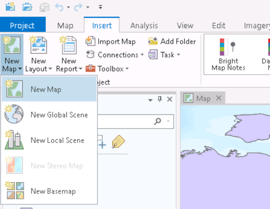

1. TOC
{:toc}

# Visual Comparison

Our end goal is to make a map comparing the Mercator Projection to the Albers Equal Area Projection.  We are not going to display WGS1984, because it is **not a projection!**  WGS 1984 is a Geographic Coordinate System, it represents positions on the *datum*.  Unless you want to use a globe, your maps should *always* be projected.  We will see how we can display latitude/longitude (from the underlying GCS) on our map.

**1**{: .label .label-red } Click the Insert tab on the top ribbon and create two new maps.

**2**{: .label .label-red } To rename a Map, double click it in the table of contents.  Name one of your Maps "Albers" and add the CAN_Albers_EA layer. to the Table of Contents.  Name the other Mercator and add the CAN_Web_Mercator.

**3**{: .label .label-red } Under the Insert tab, click New Layout.  Choose Landscape: Legal 8.5" x 14" - Landscape view (horizontal) is useful for side by side comparisons.  Choosing "Legal" gives us a bit more space to work with that "Letter".

**4**{: .label .label-red } Under the Insert tab, click New Map Frame.  Select the Mercator Map, click and drag to drape the Mercator map over the left side of the Layout.

**5**{: .label .label-red } Under the Insert tab, click New Map Frame.  Select the Albers Map, click and drag to drape the Albers map over the Right side of the Layout. *Note*

---

# Add a Graticule and Change the Scale

**6**{: .label .label-red } Change the scale and add a graticule (lines of latitude and longitude) following the video below.

<iframe width="560" height="315" src="https://www.youtube.com/embed/6L0ItZAD1zE" title="YouTube video player" frameborder="0" allow="accelerometer; autoplay; clipboard-write; encrypted-media; gyroscope; picture-in-picture" allowfullscreen></iframe>

---

# Add Map Elements

**7**{: .label .label-red } For these maps, we'll insert scale text instead of a scale bar.  Under Insert, click "Dynamic Text" and select Scale.   Add the scale text to the bottom left of each map.

**8**{: .label .label-red } We don't need a North Arrow on these maps because we have a graticule, which does a better job of showing north in many cases anyway.  With a conic projection like the Albers Equal Area, north is relative depending on where on the map you are looking, so its not very helpful anyway.  North arrows are most useful when mapping small/unfamiliar areas.

**9**{: .label .label-red } We don't need legends either since we're only showing one layer on each map.

**10**{: .label .label-red } Both maps should have a title.  Label them as follows: "Canada in the Web Mercator Projection" and "Canada in the Albers Equal Area Projection", with the titles centered above the corresponding maps.

**11**{: .label .label-red } The layout also needs a source statement.  Along the bottom add a text box with a source statement.  It should include: your name, date the map was made, affiliation (GEOS 270), and Data Source (Maya Daurio - UBC Research Commons - 2021).

---

# Save your project.

Click Save in the top left of the Arc Pro window.

---

# Export Your Layout

### FA1

Export your layout.  Name it "Projections_Compared.pdf".  Upload it to canvas.

### WA2_2

The Mercator projection is a cylindrical projection.  The Albers projection is a conic projection.  How can you tell by looking at the graticule?